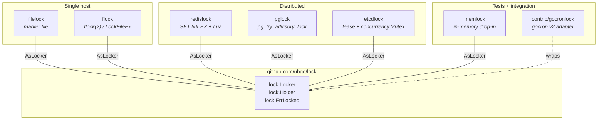
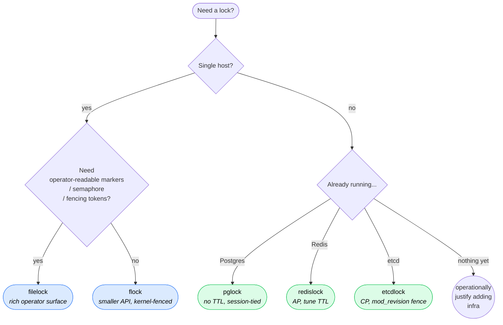

# ubgo/lock

> **One interface, five backends.** Pick `filelock`, `flock`,
> Redis, Postgres, or etcd. Swap them with one line.

[](https://pkg.go.dev/github.com/ubgo/lock)
[](https://goreportcard.com/report/github.com/ubgo/lock)
[](https://codecov.io/gh/ubgo/lock)
[](https://github.com/ubgo/lock/actions)
[](LICENSE)
[](https://github.com/ubgo/lock/tags)

A family of named-mutex implementations for Go. Single-host
(`filelock`, `flock`) and distributed (`redislock`, `pglock`,
`etcdlock`) backends share one tiny `Locker` interface — your
caller code swaps backends without changing. Crash recovery,
fencing tokens, semaphore mode, and observability hooks ship
with every backend out of the box.

## Table of contents

- [The family at a glance](#the-family-at-a-glance)
- [Why another lock library?](#why-another-lock-library)
- [Pick a backend in 30 seconds](#pick-a-backend-in-30-seconds)
- [Comparison matrix](#comparison-matrix)
- [TL;DR for each backend](#tldr-for-each-backend)
- [60-second tour: code that works for every backend](#60-second-tour-code-that-works-for-every-backend)
- [End-to-end use cases](#end-to-end-use-cases)
- [Migrating from a one-off lock library](#migrating-from-a-one-off-lock-library)
- [What's not in scope](#whats-not-in-scope)
- [Documentation](#documentation)

## The family at a glance



Each subpath is its **own Go module** with its own `go.mod`. Importing
`github.com/ubgo/lock/redislock` pulls only Redis deps; importing
`github.com/ubgo/lock/pglock` pulls only Postgres deps. **No
forced-deps; no kitchen sink.**

```
github.com/ubgo/lock                           interface  (this module)
github.com/ubgo/lock/filelock                  marker file
github.com/ubgo/lock/flock                     flock(2) / LockFileEx
github.com/ubgo/lock/redislock                 Redis SET NX EX
github.com/ubgo/lock/pglock                    Postgres advisory
github.com/ubgo/lock/etcdlock                  etcd lease + Mutex
github.com/ubgo/lock/memlock                   in-memory test backend
github.com/ubgo/lock/contrib/gocronlock        gocron v2 adapter
```

## Why another lock library?

Because the Go ecosystem has **dozens of one-off lock packages** —
each solving a sliver of the problem with a different API, a
different error model, no shared interface, and usually no path to
swap mechanisms when your infra changes (single-host → distributed).

`ubgo/lock` is the **batteries-included family**:

- **One contract.** All five backends satisfy `lock.Locker`. Your
  service code accepts `lock.Locker` and you swap concrete factories
  at startup. `flock` for local dev → `pglock` in staging →
  `etcdlock` in prod, with zero application-code changes.
- **Production-grade defaults.** Crash recovery, fencing tokens,
  observability hooks, structured logging, periodic stale cleanup.
  Things every "tutorial" lock library forgets.
- **No-surprise semantics.** Every backend's `Acquire` is
  non-blocking and returns `lock.ErrLocked` on contention — same
  sentinel everywhere. No backend silently waits, no backend uses
  a custom error type. Predictable.
- **Tested across platforms.** Linux, macOS, Windows in CI. Real
  Postgres + real etcd in CI service containers. Unit tests run
  in milliseconds via `memlock`.
- **Minimal cores.** The interface module has zero deps. Each
  backend has only the deps it needs (e.g. `pglock` has pgx,
  `redislock` has go-redis — never both).

## Pick a backend in 30 seconds



For unit tests, every backend has the same shape — substitute
`memlock.NewFactory()`.

## Comparison matrix

| Concern | filelock | flock | redislock | pglock | etcdlock |
|---|---|---|---|---|---|
| **Scope** | single-host | single-host | multi-host | multi-host | multi-host |
| **Crash recovery** | PID probe + stale window + Sweep | Kernel — instant on fd close | TTL expiry | Session close | Lease expiry |
| **Need extra infra** | none | none | Redis | Postgres | etcd cluster |
| **TTL to tune** | optional | none | yes | none | yes |
| **Reentrant** | no | no | no | **yes** (PG native) | no |
| **Fencing tokens** | per-name sidecar | per-name sidecar | per-name INCR | per-session txid | **mod_revision (global)** |
| **Semaphore (`WithMaxConcurrent`)** | ✅ | ✅ | ✅ | ✅ | ✅ |
| **Sweep** | ✅ | n/a (kernel cleans) | n/a (TTL cleans) | n/a (session cleans) | n/a (lease cleans) |
| **Operator visibility** | rich marker fields | none | `redis-cli GET <key>` | `pg_locks` view | `etcdctl get <key>` |
| **Observability hooks** | ✅ slog/metrics/spans | ✅ same | ✅ same | ✅ same | ✅ same |
| **TraceID propagation** | marker debug field | slog field | embedded in SET value | via `application_name` | in lock key value |
| **Strong consistency** | local-fs only | local-fs only | weakly (AP) | ACID single primary | ✅ Raft |

## TL;DR for each backend

| Module | One-line pitch |
|---|---|
| **`lock`** | The contract. Tiny interface (`Acquire` → `Holder` with `Release`). Zero deps. |
| **`lock/filelock`** | Marker file with PID + stale window. Operator-readable; rich features (semaphore, fencing, sweep, observability). The default if you're on one host and want to inspect markers. |
| **`lock/flock`** | Kernel-fenced via `flock(2)` / `LockFileEx`. Smallest API; the kernel handles crash safety. The default if you're on one host and want zero ops. |
| **`lock/redislock`** | Redis `SET NX EX` + Lua-guarded release. Best when you already run Redis and AP semantics are fine. |
| **`lock/pglock`** | Postgres `pg_try_advisory_lock`. Session-tied — no TTL to tune. The default if you already run Postgres. |
| **`lock/etcdlock`** | etcd lease + `concurrency.Mutex`. Strong (Raft) consistency, FIFO fairness, globally-monotonic mod_revision fencing. The default when you need rigorous correctness. |
| **`lock/memlock`** | In-memory drop-in for tests. Same `lock.Locker` interface as production. |
| **`lock/contrib/gocronlock`** | Adapter to `github.com/go-co-op/gocron/v2`. Hand any backend to `gocron.WithDistributedLocker`. |

## 60-second tour: code that works for every backend

The whole point of the family interface — your service accepts
`lock.Locker`; wiring picks the backend.

```go
package payments

import (
    "context"
    "errors"

    "github.com/ubgo/lock"
)

type Service struct {
    locks lock.Locker
}

func (s *Service) DailyExport(ctx context.Context) error {
    h, err := s.locks.Acquire(ctx, "daily-export")
    if errors.Is(err, lock.ErrLocked) {
        return nil // another worker is on it; skip
    }
    if err != nil {
        return err
    }
    defer h.Release()

    return s.runExport(ctx)
}
```

Wire any backend at startup:

```go
import (
    "github.com/redis/go-redis/v9"
    "github.com/ubgo/lock/filelock"
    "github.com/ubgo/lock/redislock"
)

// Local dev — file-based, zero infra:
svc := &payments.Service{
    locks: filelock.NewFactory(filelock.WithDir("/var/run/payments")).AsLocker(),
}

// Production — Redis (already deployed):
rdb := redis.NewClient(&redis.Options{Addr: cfg.RedisAddr})
svc := &payments.Service{
    locks: redislock.NewFactory(rdb, redislock.WithTTL(2*time.Minute)).AsLocker(),
}

// Tests — fast in-memory:
import "github.com/ubgo/lock/memlock"
svc := &payments.Service{locks: memlock.NewFactory().AsLocker()}
```

`payments.Service` doesn't import any concrete backend — it depends
only on `github.com/ubgo/lock` (zero-dep interface). The N concrete
backends sit at the wiring layer and never bleed into business
code.

## End-to-end use cases

### 1. Cron-singleton across N replicas of a service

You run 3 replicas of a service in Kubernetes; they all wake up at
midnight to run the same cron. Only one should actually do the work.

```go
locks := redislock.NewFactory(rdb, redislock.WithTTL(10*time.Minute))

err := locks.WithLock(ctx, "midnight-billing", processBilling)
if errors.Is(err, redislock.ErrLocked) {
    log.Info("billing run already in progress on another replica")
    return nil
}
return err
```

Three replicas race; one wins the SET-NX, the other two skip. If the
winner crashes mid-job, the Redis TTL expires after 10min and the
next run takes over. No leader election infra; no ZooKeeper.

### 2. "Skip if already running" — single-host CLI

A nightly import job; you don't want it overlapping itself if a
previous run is slow.

```go
fl := flock.New("nightly-import", flock.WithDir("/var/run"))
holder, err := fl.Acquire(ctx)
if errors.Is(err, flock.ErrLocked) {
    log.Println("previous run still active; skipping")
    return
}
defer holder.Release()
runImport(ctx)
```

`flock` is enough here — single host, kernel-fenced, no TTL to
tune. If the run crashes (kernel panic, OOM, ctrl-C), the kernel
releases the lock when the process descriptor closes; the next
run starts cleanly.

### 3. Fencing tokens — defend against the GC-pause scenario

Process A acquires, gets paused by a long GC, the lock is
auto-reclaimed (TTL expiry), B acquires, then A wakes up and
tries to write with stale data. Without fencing, A's write
overwrites B's. With fencing tokens:

```go
holder, _ := locks.Acquire(ctx, "payment-export")
defer holder.Release()
fence := holder.Token()  // monotonic uint64

if err := s3.PutWithFence(ctx, "payments/today.csv", data, fence); err != nil {
    return err
}
```

The downstream wrapper records the highest token it has seen and
rejects writes with `token < highest`. A's stale write fails; B's
fresh write succeeds. (This is Kleppmann's "How to do distributed
locking" defense, in 8 lines.)

### 4. Long-running job — extend the lease as you go

Default Redis TTL is 30s; your job legitimately runs for 2 hours.
Don't blanket-set TTL=2h (that means crash recovery takes 2h);
instead extend the lease while the job is alive:

```go
holder, _ := locks.Acquire(ctx, "long-export", redislock.WithTTL(2*time.Minute))
defer holder.Release()

go func() {
    t := time.NewTicker(time.Minute)
    defer t.Stop()
    for {
        select {
        case <-ctx.Done():
            return
        case <-t.C:
            if err := holder.Extend(ctx); err != nil {
                cancel() // lock lost — abort
                return
            }
        }
    }
}()

return runLongExport(ctx)
```

Crash recovery still kicks in within 2min if the job dies; healthy
runs hold the lock indefinitely.

### 5. Periodic stale-cleanup (filelock)

In semaphore mode (or after rare crashes), markers can pile up.
Sweep them on a schedule, protected by its own filelock:

```go
go func() {
    t := time.NewTicker(5 * time.Minute)
    defer t.Stop()
    for range t.C {
        locks.WithLock(ctx, "filelock-sweep", func(ctx context.Context) error {
            n, _ := locks.Sweep(ctx)
            slog.Info("filelock sweep", "reclaimed", n)
            return nil
        })
    }
}()
```

### 6. Backend-agnostic tests with `memlock`

```go
func TestProcessPayments(t *testing.T) {
    locks := memlock.NewFactory()
    svc := &payments.Service{locks: locks.AsLocker()}

    if err := svc.DailyExport(context.Background()); err != nil {
        t.Fatal(err)
    }
    // memlock runs in microseconds — no Redis, no Postgres, no filesystem.
}
```

## Migrating from a one-off lock library

The shape is small and consistent enough that migrations are
typically 1-line-per-call-site:

| Was | Now |
|---|---|
| `lock.Lock(); defer lock.Unlock()` | `h, err := locks.Acquire(ctx, "x"); defer h.Release()` |
| `lock.TryLock()` (no error) | `h, err := locks.Acquire(ctx, "x"); errors.Is(err, lock.ErrLocked)` |
| `lock.Lock(timeout)` (blocking) | `ctx, _ := context.WithTimeout(ctx, timeout); locks.Acquire(ctx, "x")` |

For services with many lock names sharing config, the `Factory`
pattern collapses 5 lines of boilerplate to one per call site.

## What's not in scope

- **Reentrant locks** (except `pglock`, which inherits Postgres'
  native reentrancy). Reentrancy hides design problems; we follow
  Go's `sync.Mutex` stance — refactor to `xxxLocked()` helpers
  instead. See [`docs/non-goals.md`](./docs/non-goals.md).
- **Wait-or-block APIs.** Every `Acquire` is non-blocking and returns
  `ErrLocked` immediately. If you want a deadline, wrap with
  `context.WithTimeout`. Marker locks aren't the right tool for
  serialising long work.
- **Redlock-style multi-master Redis.** `redislock` is single-master
  (Sentinel-friendly). For quorum-correct distributed locking,
  use `etcdlock` — Raft does that job correctly.

## Documentation

Start here: [`docs/README.md`](./docs/README.md) is the full index.

**Per-backend guides** (when to use, full API, worked examples, flaws):

- [`docs/guides/filelock.md`](./docs/guides/filelock.md)
- [`docs/guides/flock.md`](./docs/guides/flock.md)
- [`docs/guides/redislock.md`](./docs/guides/redislock.md)
- [`docs/guides/pglock.md`](./docs/guides/pglock.md)
- [`docs/guides/etcdlock.md`](./docs/guides/etcdlock.md)
- [`docs/guides/memlock.md`](./docs/guides/memlock.md)
- [`docs/guides/gocronlock.md`](./docs/guides/gocronlock.md)

**Cross-cutting**:

- [`docs/use-cases.md`](./docs/use-cases.md) — **12 real-world
  scenarios with copy-paste code**: cron singleton, leader
  election, GC-pause defense, migration runner, per-tenant
  serialization, worker pool, gocron, …
- [`docs/family-comparison.md`](./docs/family-comparison.md) —
  full side-by-side capability matrix and decision matrix
  across the family.
- [`docs/comparison.md`](./docs/comparison.md) — feature matrix
  vs **other** Go locking libraries.
- [`docs/snippets.md`](./docs/snippets.md) — 15 copy-paste recipes.
- [`docs/migration.md`](./docs/migration.md) — line-by-line
  migration from each major Go lock library.
- [`docs/non-goals.md`](./docs/non-goals.md) — what we deliberately
  don't ship and why.
- [`docs/flaws.md`](./docs/flaws.md) — honest limitations.
  **Read before adopting in production.**

**Design**:

- [`docs/design/crash-recovery.md`](./docs/design/crash-recovery.md)
- [`docs/design/fencing-tokens.md`](./docs/design/fencing-tokens.md)
- [`docs/design/observability.md`](./docs/design/observability.md)
- [`docs/design/races.md`](./docs/design/races.md)

## License

Apache-2.0 — see [`LICENSE`](LICENSE).
