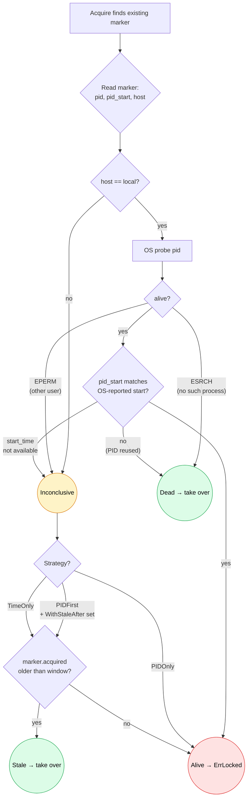

# Design — crash recovery across the family

What happens when the holder process dies mid-job? Five backends,
five mechanisms. This page documents each in detail so you can
reason about your service's failure mode.

## TL;DR

| Backend | Mechanism | Recovery latency | Cost |
|---|---|---|---|
| `flock` | Kernel releases on fd close | **Immediate** | None — kernel does it. |
| `pglock` | Postgres releases on session disconnect | **Immediate** | None — DB does it. |
| `redislock` | TTL expiry | Up to TTL (typically 30s–10m) | TTL must be sized; tradeoff. |
| `etcdlock` | Lease expiry | Up to TTL (typically 30s–60s) | TTL + auto-keepalive overhead. |
| `filelock` | PID probe + `WithStaleAfter` + `Sweep` | PID probe: instant; otherwise up to stale window | Operator visibility into stale markers. |
| `memlock` | n/a (single process) | Process exit = lock gone | None. |

## flock

When you call `Acquire`, the kernel records a lock on the **file
descriptor**. The lock is automatically released when:

- You call `Holder.Release` (closes the fd) — clean shutdown.
- Your process exits — clean or otherwise. The kernel iterates
  the process's open fd table at exit and releases all locks.

**Failure modes the kernel handles:**

- `kill -9` / SIGKILL
- Panic
- OOM kill
- Kernel panic / hard reboot — when the kernel comes back, no
  state to clean up.
- Network partition (irrelevant; flock is single-host).

**Failure modes flock does NOT handle:**

- Marker file lingering on disk after Release. The lock state was
  in the kernel's fd table; the file is just a handle. Cosmetic
  issue only.
- Cross-host coordination (don't use flock on NFS).

## pglock

`pg_try_advisory_lock(K)` records a lock against the **session**
(Postgres connection). Release happens when:

- You call `Holder.Release` — runs `pg_advisory_unlock(K)` on the
  same connection.
- The connection drops — Postgres notices and releases all
  advisory locks held by that session. This is automatic.

**Failure modes Postgres handles:**

- Process crash → TCP RST or timeout → Postgres releases.
- Network partition long enough that Postgres declares the
  connection dead → release.
- Postgres restart → all sessions die → all advisory locks
  release. (Anyone reconnecting takes them again.)

**Failure modes pglock does NOT handle:**

- A connection that's "dead" but Postgres hasn't noticed yet
  (inside the TCP keepalive grace period). During this window
  the lock is still recorded. Mitigation: tune
  `tcp_keepalives_idle` / `tcp_keepalives_interval` Postgres
  settings.
- Your code keeping a Holder around after the underlying
  connection reset. Holder.Release will (correctly) report
  no-op, but your code may have done un-protected work since
  the disconnect. Mitigation: fencing tokens (planned).

## redislock

`SET key value NX EX <ttl>` records the holder in Redis with an
auto-expiry. Release happens when:

- You call `Holder.Release` — runs the Lua-guarded DEL.
- The TTL elapses — Redis deletes the key.

**Failure modes TTL handles:**

- Process crash, OOM, kill, hardware fail — after TTL, key gone.
- Network partition that lasts longer than TTL — same.
- Redis primary dies → replica is promoted → IF the SET-NX hadn't
  replicated, the new primary doesn't have the key → next caller
  wins. (Two holders during the partition; this is the AP
  semantics issue.)

**Failure modes TTL does NOT handle well:**

- Healthy long jobs: TTL too short → lock expires while job runs
  → another holder acquires → two holders. Mitigation:
  `Holder.Extend(ctx)` periodically.
- Tight TTL + slow GC pause → same problem. Mitigation: fencing
  tokens close the gap downstream.

### TTL sizing math

Two competing pressures:

```
TTL >= max healthy run time + safety margin    (don't lose lock to timeout)
TTL <= max acceptable recovery latency         (don't strand resources)
```

If your job runs for hours, set TTL=2min and renew with
`Extend()` every minute. If your job runs for seconds, set
TTL=30s and don't bother with Extend.

## etcdlock

A Session = lease + auto-keepalive goroutine. The keepalive
extends the lease while the holder is healthy, so healthy
holders never lose the lock.

Release happens when:

- You call `Holder.Release` — `concurrency.Mutex.Unlock(ctx)`
  + `session.Close()` (revokes the lease).
- The lease expires — etcd deletes the lock key. Lease expires
  when the keepalive stops (process death, network partition).

**Failure modes lease handles:**

- Process crash → keepalive stops → after TTL, lease expires.
- Network partition → keepalive stops → after TTL, lease expires
  (cluster perspective).
- Etcd primary dies → Raft elects new leader → lease state was
  replicated → continuity preserved (this is etcd's CP
  guarantee).

**Failure modes etcdlock does NOT handle:**

- A partition that lasts longer than TTL: the holder still
  thinks it holds the lock; the cluster has reclaimed it.
  When the partition heals, the holder's writes (with stale
  mod_revision) need to be rejected by downstream consumers.
  This is what `Holder.Token()` is for.

### Auto-keepalive details

`concurrency.NewSession(cli, concurrency.WithTTL(30))` starts a
goroutine that pings etcd every TTL/3 seconds. As long as the
client process is alive AND can reach etcd, the keepalive
succeeds and the lease is renewed.

If the keepalive fails twice in a row (network blip), the
session goroutine reports the error via `session.Done()`. We
don't currently surface this on `*Holder` — improving this is
on the roadmap.

## filelock

The richest mechanism, with three layers:

### Layer 1: PID liveness probe (the primary signal)

When `Acquire` finds an existing marker, it:

1. Reads the marker's `pid`, `pid_start`, `host`.
2. If `host` matches the local hostname, probes the PID via
   the OS:
   - **Linux/macOS/BSD** — `kill(pid, 0)`. ESRCH = dead, success
     = alive, EPERM = inconclusive.
   - **Windows** — `OpenProcess(QUERY_LIMITED, false, pid)`.
3. If alive AND start_time matches → ErrLocked.
4. If alive AND start_time mismatches → PID was reused, take over.
5. If dead → take over.
6. If inconclusive (EPERM, host mismatch, platform doesn't expose
   start_time) → fall through to Layer 2.



### Layer 2: WithStaleAfter time fallback

If the PID probe was inconclusive, check whether the marker's
`acquired` timestamp is older than the configured
`WithStaleAfter` window. If so, take over. Otherwise ErrLocked.

This is the cross-host fallback (PIDs are host-local) and the
defense for cases where the OS won't tell us about the PID
(different UID, container weirdness).

### Layer 3: Sweep

`Factory.Sweep(ctx)` walks `<dir>/*.lock` and runs the staleness
check on every marker. Markers whose holders are dead get
removed — even if Acquire never gets called for that name.

This catches markers that pile up during semaphore-mode crashes
(slot 2 crashed but everyone's been acquiring slot 0, so slot 2's
marker would never get reclaimed without Sweep).

### PID-reuse detection (Linux only currently)

The kernel recycles PID numbers. After process A (PID 12345)
crashes, the OS may assign 12345 to an unrelated process B that's
still running. Naive "kill -0" check would say "alive" and we'd
conclude the lock is held — same self-perpetuating-stale-lock bug
we wanted to fix.

Mitigation: the marker stores `pid_start` (the process's start
time as the kernel reports it). On takeover we re-read the
PID's current start time and compare. Mismatch → PID was reused
→ stale → take over.

Currently implemented for Linux (via `/proc/<pid>/stat` field
22). macOS / Windows don't have this; the probe trusts the
alive answer and falls back to `WithStaleAfter` if the holder
turns out to have been a stranger.

### Foot-gun: WithStaleAfter is not a runtime cap

Beginners read it as "max runtime for this job." It's not — it's
"how long after the holder appears dead can the next acquire take
over." Subtleties depend on the strategy:

- `PIDFirst` (default): time fallback only when probe is
  inconclusive. Generous values (1h, 24h) are safe.
- `PIDOnly`: time never consulted.
- `TimeOnly`: time always consulted. If shorter than your job's
  healthy run time → parallel execution.

See MISSION §4.9 for the foot-gun walkthrough with concrete
timestamps.

## memlock

In-memory map. Process exit = state gone. There's no recovery
because there's no persistence — by design. Use only for tests.

## Common patterns

### Defense in depth: PID/lease/TTL + fencing tokens

The safest pattern across all distributed backends:

1. Use the backend's native crash recovery (TTL / lease / session).
2. Capture `Holder.Token()` after Acquire.
3. Pass the fence token to your downstream consumer.
4. Consumer rejects writes with `token < highest seen`.

This makes the lock library's failure mode (split-brain during
partitions, GC-pause + TTL expiry) into a consumer-side
no-op rather than a corruption.

See [`fencing-tokens.md`](./fencing-tokens.md) for the deep dive.
