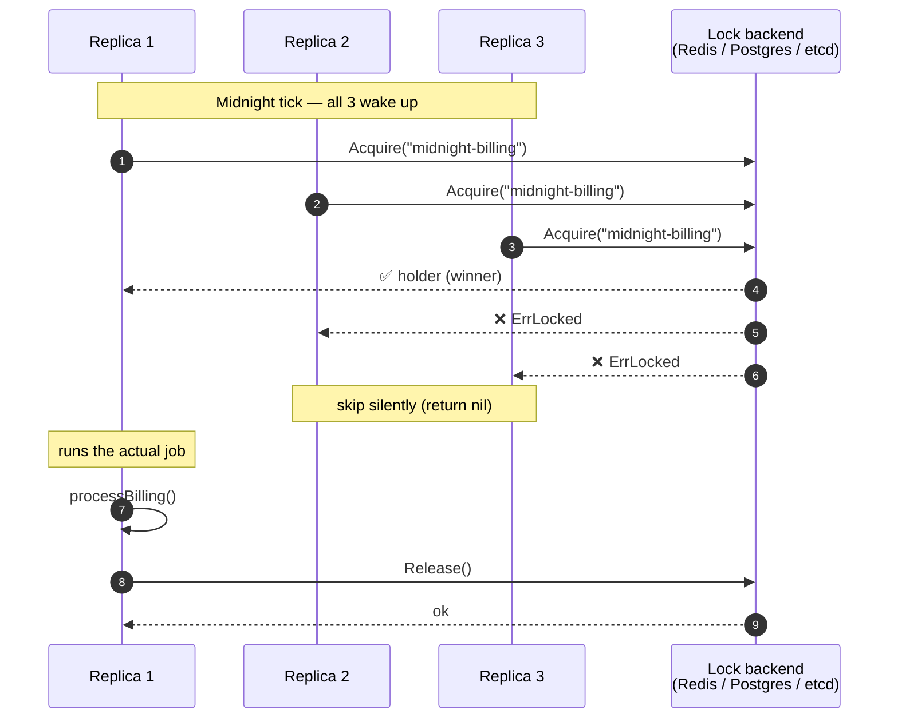

# Use cases — real scenarios with concrete code

Twelve real-world locking scenarios. Each one shows:

1. The scenario (what's the problem?)
2. The right backend (and why)
3. Worked code, copy-paste-ready
4. Operational notes

## Index

| # | Scenario | Backend |
|---|---|---|
| 1 | Cron singleton on one host (no replicas) | flock or filelock |
| 2 | Cron singleton across N replicas | pglock / redislock / etcdlock |
| 3 | Idempotent webhook handler | filelock or pglock |
| 4 | Long-running export with renewal | redislock + Extend |
| 5 | Throughput-bounded worker pool (N parallel) | filelock semaphore |
| 6 | Leader election for periodic background work | etcdlock |
| 7 | Defending against GC-pause split brain | any + fencing |
| 8 | Migration runner (one-shot guarded operation) | pglock |
| 9 | Per-user / per-tenant action serialization | redislock |
| 10 | Backup orchestration across machines | etcdlock |
| 11 | "Flaky retries" deduplication | filelock + WithStaleAfter |
| 12 | Scheduling primitive — gocron with cluster locking | gocronlock + any backend |

---

## 1. Cron singleton on one host

**Problem.** A nightly cron import runs on a single VM. If a
previous run is still going (or has a stuck process from a previous
crash), don't overlap.

**Backend.** `flock` (kernel-fenced, simplest) or `filelock` (if you
want operator-readable markers).

**Code (`flock`):**

```go
import (
    "context"
    "errors"
    "log"

    "github.com/ubgo/lock/flock"
)

func main() {
    ctx := context.Background()
    fl := flock.New("nightly-import", flock.WithDir("/var/run/myservice"))

    holder, err := fl.Acquire(ctx)
    if errors.Is(err, flock.ErrLocked) {
        log.Println("previous run still active; skipping")
        return
    }
    if err != nil { log.Fatal(err) }
    defer holder.Release()

    runImport(ctx)
}
```

**Notes.** No TTL to size. Kernel releases on any process exit. If
the previous run crashed, this run starts cleanly with no manual
cleanup. **Move to `filelock` if** you want `cat /var/run/.../*.lock`
to show PID/host/trace_id for ops.

---

## 2. Cron singleton across N replicas

**Problem.** A service runs in 3 replicas behind a load balancer.
A cron fires on each replica every hour; only one should actually
do the work.



**Backend.** Whichever distributed primitive you already have:
- `pglock` if you run Postgres (cleanest crash story; no TTL).
- `redislock` if you run Redis (fast; tune TTL).
- `etcdlock` if you run etcd (CP; globally-monotonic fencing).

**Code (`pglock`):**

```go
import (
    "context"
    "errors"
    "log"

    "github.com/jackc/pgx/v5/pgxpool"
    "github.com/ubgo/lock/pglock"
)

type Service struct {
    locks *pglock.Factory
}

func New(pool *pgxpool.Pool) *Service {
    return &Service{locks: pglock.NewFactory(pool)}
}

func (s *Service) HourlyAggregate(ctx context.Context) error {
    err := s.locks.WithLock(ctx, "hourly-aggregate", func(ctx context.Context) error {
        return aggregate(ctx)
    })
    if errors.Is(err, pglock.ErrLocked) {
        log.Println("aggregate already running on another replica")
        return nil
    }
    return err
}
```

**Notes.** All three replicas call `HourlyAggregate` simultaneously;
only one wins the `pg_try_advisory_lock`. If the winner crashes mid-job,
Postgres releases when the connection drops — next hour another
replica wins. No stuck locks.

---

## 3. Idempotent webhook handler

**Problem.** A payment processor retries webhooks aggressively. Two
identical webhooks arriving 10ms apart should be processed once.

**Backend.** `filelock` (single-host) or `pglock` (multi-host).

**Code (`filelock`):**

```go
import (
    "context"
    "errors"
    "fmt"
    "net/http"

    "github.com/ubgo/lock/filelock"
)

type WebhookHandler struct {
    locks *filelock.Factory
}

func (h *WebhookHandler) HandleStripe(w http.ResponseWriter, r *http.Request) {
    eventID := r.Header.Get("Stripe-Event-Id")
    if eventID == "" {
        http.Error(w, "missing event id", 400)
        return
    }

    err := h.locks.WithLock(r.Context(),
        fmt.Sprintf("stripe-event:%s", eventID),
        func(ctx context.Context) error {
            return processStripeEvent(ctx, eventID)
        },
        filelock.WithStaleAfter(5*time.Minute),
    )
    switch {
    case errors.Is(err, filelock.ErrLocked):
        // Another worker is already processing this event. Tell
        // Stripe we got it; the other worker will finish.
        w.WriteHeader(200)
    case err != nil:
        http.Error(w, err.Error(), 500)
    default:
        w.WriteHeader(200)
    }
}
```

**Notes.** The lock name encodes the dedup key (event ID). If
processing crashes, `WithStaleAfter` lets the next retry take over
after 5 minutes. For multi-host, swap to `pglock` — same code.

---

## 4. Long-running export with renewal

**Problem.** A daily payment export takes 90 minutes on average. You
want a 5-minute crash-recovery window — much shorter than the job.

**Backend.** `redislock` with `Holder.Extend` for renewal.

**Code:**

```go
import (
    "context"
    "errors"
    "log/slog"
    "time"

    "github.com/redis/go-redis/v9"
    "github.com/ubgo/lock/redislock"
)

func DailyPaymentsExport(ctx context.Context, rdb *redis.Client) error {
    locks := redislock.NewFactory(rdb,
        redislock.WithTTL(5*time.Minute),
        redislock.WithKeyPrefix("payments-export"),
    )

    holder, err := locks.Acquire(ctx, "daily-export")
    if errors.Is(err, redislock.ErrLocked) {
        slog.Info("daily export already running on another replica")
        return nil
    }
    if err != nil { return err }
    defer holder.Release()

    // Renewal goroutine: Extend the TTL every 2 minutes (well within
    // the 5-minute window).
    ctx, cancel := context.WithCancel(ctx)
    defer cancel()
    go func() {
        t := time.NewTicker(2 * time.Minute)
        defer t.Stop()
        for {
            select {
            case <-ctx.Done():
                return
            case <-t.C:
                if err := holder.Extend(ctx); err != nil {
                    slog.Error("lost lock — aborting export", "err", err)
                    cancel() // signals runExport to bail
                    return
                }
            }
        }
    }()

    return runExport(ctx)
}
```

**Notes.** TTL=5min means a crashed holder is reclaimed in ≤5 min.
Healthy holders keep the lock indefinitely via `Extend`. If a
network partition drops the holder for >5 min, `Extend` will return
`ErrLockLost` and the renewal goroutine cancels the work — pair
with fencing tokens for full safety.

---

## 5. Throughput-bounded worker pool (N parallel)

**Problem.** You have 50 batches to index. Indexing is CPU-heavy
and you don't want more than 3 indexers running concurrently —
beyond 3 you saturate the search backend.

**Backend.** `filelock` semaphore mode (`WithMaxConcurrent`).

**Code:**

```go
import (
    "context"
    "errors"
    "sync"

    "github.com/ubgo/lock/filelock"
)

func IndexBatches(ctx context.Context, batches []Batch) error {
    locks := filelock.NewFactory(filelock.WithDir("/var/run/myservice"))

    var wg sync.WaitGroup
    for _, batch := range batches {
        wg.Add(1)
        go func(b Batch) {
            defer wg.Done()
            for {
                err := locks.WithLock(ctx, "indexer",
                    func(ctx context.Context) error {
                        return indexBatch(ctx, b)
                    },
                    filelock.WithMaxConcurrent(3),
                )
                if errors.Is(err, filelock.ErrLocked) {
                    // All 3 slots busy; backoff and retry.
                    time.Sleep(100 * time.Millisecond)
                    continue
                }
                return // success or non-retry-able error
            }
        }(batch)
    }
    wg.Wait()
    return nil
}
```

**Notes.** Three slots, 50 jobs queued via the retry loop. Each batch
runs on the first available slot. Layout on disk:
`<dir>/indexer.0.lock`, `.1.lock`, `.2.lock`.

---

## 6. Leader election for periodic background work

**Problem.** Across 5 replicas, one should be the "leader" running
periodic background tasks (cache warming, slow stats aggregation).
If the leader dies, another replica takes over within 30 seconds.

**Backend.** `etcdlock` — Raft gives strong consistency on the
"who's leader" question.

**Code:**

```go
import (
    "context"
    "errors"
    "log/slog"
    "time"

    clientv3 "go.etcd.io/etcd/client/v3"
    "github.com/ubgo/lock/etcdlock"
)

func RunAsLeader(ctx context.Context, cli *clientv3.Client) {
    locks := etcdlock.NewFactory(cli, etcdlock.WithTTL(30*time.Second))

    for {
        if err := ctx.Err(); err != nil {
            return
        }

        holder, err := locks.Acquire(ctx, "leader")
        if errors.Is(err, etcdlock.ErrLocked) {
            slog.Debug("not the leader; sleeping")
            time.Sleep(5 * time.Second)
            continue
        }
        if err != nil {
            slog.Error("etcd error; backing off", "err", err)
            time.Sleep(10 * time.Second)
            continue
        }

        // We're the leader. Run leader-only work until ctx cancels
        // or we lose the lock.
        slog.Info("became leader", "fence", holder.Token())
        runLeaderWork(ctx)

        _ = holder.Release()
    }
}
```

**Notes.** The TTL=30s + auto-keepalive means a healthy leader
never loses its position. If the leader dies, the next caller's
`Acquire` succeeds within 30s (lease expiry). The `Token()` is
useful as a leader-epoch number — when the leader changes, the
epoch increments, and downstream consumers can reject stale
leader actions.

---

## 7. Defending against GC-pause split brain

**Problem.** Process A holds a lock, gets GC-paused for 45 seconds,
TTL expires, B acquires, A resumes and tries to write to S3 with
stale data.

**Backend.** Any backend with fencing tokens (`filelock`,
`memlock`, `redislock`, `etcdlock`).

**Code:**

```go
import (
    "context"
    "errors"

    "github.com/ubgo/lock/redislock"
)

type FencedStore struct {
    s3      *s3.Client
    fences  *FenceTracker  // persists highest fence per key
}

func (s *FencedStore) Put(ctx context.Context, key string, data []byte, fence uint64) error {
    // Atomically: check fence is highest seen, then upload.
    if err := s.fences.RejectIfStale(ctx, key, fence); err != nil {
        return err
    }
    return s.s3.Put(ctx, key, data)
}

func ExportPayments(ctx context.Context, locks *redislock.Factory, store *FencedStore) error {
    holder, err := locks.Acquire(ctx, "payments-export")
    if errors.Is(err, redislock.ErrLocked) {
        return nil // someone else is exporting
    }
    if err != nil { return err }
    defer holder.Release()

    fence := holder.Token() // monotonic uint64

    data, err := buildExport(ctx)
    if err != nil { return err }

    return store.Put(ctx, "payments/today.csv", data, fence)
}
```

**Notes.** The `Put` rejects writes with `fence < highest_seen`. If
A wakes up after a GC pause and tries to upload with its stale
fence, the upload is rejected — B's data is preserved. See
[`design/fencing-tokens.md`](./design/fencing-tokens.md) for the
consumer-side implementation details.

---

## 8. Migration runner (one-shot guarded operation)

**Problem.** A schema migration must run **exactly once** when
your service starts. Multiple replicas booting simultaneously
shouldn't all run the migration.

**Backend.** `pglock` (the natural fit — same Postgres connection
as the migration itself).

**Code:**

```go
import (
    "context"
    "errors"
    "log/slog"

    "github.com/jackc/pgx/v5/pgxpool"
    "github.com/ubgo/lock/pglock"
)

func RunMigrations(ctx context.Context, pool *pgxpool.Pool) error {
    locks := pglock.NewFactory(pool)

    return locks.WithLock(ctx, "schema-migrations", func(ctx context.Context) error {
        slog.Info("running migrations")
        return migrate.Run(ctx, pool)
    })
    // On other replicas, this returns ErrLocked silently — they're
    // happy to skip and let the elected replica do the work.
}
```

**Notes.** All replicas call `RunMigrations` at startup. The first
to acquire runs `migrate.Run`. Others get `ErrLocked` and skip. If
the migrating replica crashes mid-migration, Postgres releases the
advisory lock (session disconnect), and the next replica's startup
wins the lock and continues / retries.

The lock is held only for the duration of `migrate.Run` — which
includes the DB transactions inside `migrate.Run`, so there's no
window where the lock is gone but the migration hasn't committed.

---

## 9. Per-user / per-tenant action serialization

**Problem.** A user can submit a "rebuild my timeline" request that
takes 30 seconds. If they click 5 times in a row, you want to
serialize: only one rebuild per user runs at a time.

**Backend.** `redislock` (per-user lock name; many concurrent
different-user locks scale fine).

**Code:**

```go
import (
    "context"
    "errors"
    "fmt"
    "time"

    "github.com/redis/go-redis/v9"
    "github.com/ubgo/lock/redislock"
)

type RebuildHandler struct {
    locks *redislock.Factory
}

func (h *RebuildHandler) Rebuild(ctx context.Context, userID string) error {
    lockName := fmt.Sprintf("rebuild-timeline:%s", userID)

    err := h.locks.WithLock(ctx, lockName, func(ctx context.Context) error {
        return rebuildTimeline(ctx, userID)
    }, redislock.WithTTL(2*time.Minute))

    if errors.Is(err, redislock.ErrLocked) {
        // Tell the user a rebuild is already in progress.
        return ErrAlreadyInProgress
    }
    return err
}
```

**Notes.** Lock name is per-user. User Alice's rebuild doesn't block
user Bob's rebuild. Each user's clicks within one job's runtime
collapse to a single rebuild. TTL=2min is the recovery window if
the worker crashes.

---

## 10. Backup orchestration across machines

**Problem.** A backup job (snapshot DB → upload to S3) must run
exactly once per day across a 10-host fleet. The first host to wake
up wins; everyone else skips.

**Backend.** `etcdlock` for rigorous correctness, OR `redislock`
if AP is fine.

**Code (`etcdlock`):**

```go
import (
    "context"
    "errors"
    "time"

    clientv3 "go.etcd.io/etcd/client/v3"
    "github.com/ubgo/lock/etcdlock"
)

func DailyBackup(ctx context.Context, cli *clientv3.Client) error {
    locks := etcdlock.NewFactory(cli,
        etcdlock.WithTTL(2*time.Hour), // long backup
        etcdlock.WithKeyPrefix("backups"),
    )

    return locks.WithLock(ctx, fmt.Sprintf("backup-%s",
        time.Now().UTC().Format("2006-01-02")),
        func(ctx context.Context) error {
            return runBackup(ctx)
        })
    // ErrLocked → another host is doing today's backup. Skip silently.
}
```

**Notes.** The lock name includes the date so each day gets its own
lock. TTL=2h is the recovery window if the backing-up host crashes.
If you'd rather have a hard ceiling on the backup runtime, also
wrap the inner ctx with `context.WithTimeout`.

---

## 11. "Flaky retries" deduplication

**Problem.** A scheduler retries failed jobs aggressively. A
retried job that's still actually running (just hasn't reported
back yet) shouldn't be re-launched.

**Backend.** `filelock` with `WithStaleAfter` for deferred cleanup.

**Code:**

```go
import (
    "context"
    "errors"
    "fmt"
    "time"

    "github.com/ubgo/lock/filelock"
)

func RunJob(ctx context.Context, locks *filelock.Factory, jobID string) error {
    err := locks.WithLock(ctx,
        fmt.Sprintf("job:%s", jobID),
        func(ctx context.Context) error {
            return runJobBody(ctx, jobID)
        },
        filelock.WithStaleAfter(30*time.Minute),
    )
    if errors.Is(err, filelock.ErrLocked) {
        // Another retry is in flight. Don't run this one.
        return nil
    }
    return err
}
```

**Notes.** If an earlier retry crashed, `WithStaleAfter(30m)` allows
this retry to take over after 30 minutes (the time fallback only
kicks in when the PID probe is inconclusive — e.g. cross-host).
Same-host crashes are reclaimed instantly via the PID probe.

---

## 12. Scheduling primitive — gocron with cluster locking

**Problem.** You use `github.com/go-co-op/gocron/v2` for scheduling.
Three replicas. Don't want every job to fire on every replica.

**Backend.** `contrib/gocronlock` adapter + any family backend.

**Code:**

```go
import (
    "time"

    "github.com/go-co-op/gocron/v2"
    "github.com/redis/go-redis/v9"
    "github.com/ubgo/lock/contrib/gocronlock"
    "github.com/ubgo/lock/redislock"
)

func newScheduler(rdb *redis.Client) (gocron.Scheduler, error) {
    locks := redislock.NewFactory(rdb, redislock.WithTTL(10*time.Minute))

    s, err := gocron.NewScheduler(
        gocron.WithDistributedLocker(gocronlock.New(locks.AsLocker())),
    )
    if err != nil { return nil, err }

    s.NewJob(
        gocron.DurationJob(time.Minute),
        gocron.NewTask(syncJob),
        gocron.WithName("sync-data"),  // ALWAYS set — used as lock key
    )
    s.NewJob(
        gocron.CronJob("0 0 * * *", false),
        gocron.NewTask(processBilling),
        gocron.WithName("midnight-billing"),
    )

    return s, nil
}
```

**Notes.** Each job has a stable name; gocron uses it as the lock
key on every tick. Three replicas → only one wins the SET-NX → only
one runs the job. Swap `redislock` for any other family backend
without touching the scheduler code.

---

## Patterns that span scenarios

### Always check `errors.Is(err, <backend>.ErrLocked)`

Across the family every backend returns its own `ErrLocked`
sentinel that wraps the family's `lock.ErrLocked`. Code that uses
the concrete backend can check the concrete sentinel; code against
the `lock.Locker` interface should check `lock.ErrLocked`.

### Always use `WithLock` for the basic case

`WithLock(ctx, name, fn, opts...)` is `Acquire → defer Release →
fn` collapsed to one call. It releases on panic too (deferred).
You only need bare `Acquire`/`Release` when:

- You need to inspect the holder before running work (e.g. capture
  the fence token).
- You need to release in a different goroutine than the one that
  acquired.

### Always set a sensible context

Acquire respects `ctx.Done()`. For interactive paths (HTTP
handlers), use the request's ctx so canceling the request also
abandons the acquire. For batch jobs, use a parent ctx with a
deadline that exceeds the longest healthy run time.

### Always test against `memlock`

Production code wires the real backend. Tests wire `memlock`. The
interface is the same. Tests run in microseconds and have no
infrastructure dependencies.
